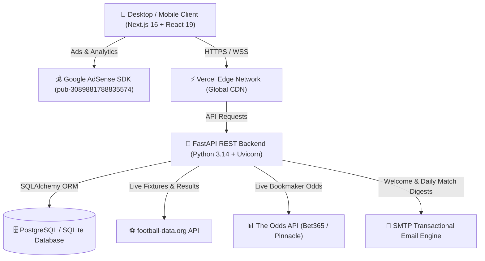

# ⚽ FootballPredict Platform — Full System Architecture & Complete Technical Documentation

**Version:** 2.4 Enterprise Production Release  
**Live Production URL:** [https://footballprediction-lovat.vercel.app](https://footballprediction-lovat.vercel.app)  
**Live Backend API:** [https://football-prediction-api-mmet.onrender.com](https://football-prediction-api-mmet.onrender.com)  
**Admin Portal:** [https://footballprediction-lovat.vercel.app/admin](https://footballprediction-lovat.vercel.app/admin)  
**Admin Account:** `Wes@254` (`davidwesonga776@gmail.com`)  
**Google AdSense Publisher ID:** `pub-3089881788835574` (`ca-pub-3089881788835574`)  
**PDF Document:** [Football_Prediction_System_Architecture_and_Documentation.pdf](./Football_Prediction_System_Architecture_and_Documentation.pdf)

---

## 1. Executive Summary & Vision

**FootballPredict** is a full-stack, enterprise-grade football match intelligence, statistical modeling, and multi-market prediction ecosystem. The platform serves fans, analytical predictors, and casual bettors with:
- High-resolution match fixtures grouped chronologically by date (`Today`, `Tomorrow`, upcoming dates).
- Real-time live scores, match statuses, and final results across 8 major world leagues.
- Statistical probability breakdowns across 4 distinct markets:
  1. **1X2 Match Winner** (Home, Draw, Away probabilities)
  2. **Over / Under 2.5 Goals**
  3. **Both Teams to Score (BTTS)**
  4. **Double Chance** (1X, X2, 12)
- **Coach AI Assistant:** A conversational football intelligence chatbot equipped with match analysis reasoning.
- **Community Leaderboard & Gamification:** Points system with automated scoring rules.
- **Administrative Telemetry Dashboard:** Inactivity auto-logout, live data sync triggers, odds sync, and email dispatchers.
- **Google AdSense Monetization:** 5 responsive native and display ad units with GDPR consent management.

---

## 2. High-Level System Architecture & Component Topology

---

## 3. Technology Stack Breakdown

### Frontend Presentation Layer
- **Framework:** Next.js 16 (App Router) + React 19
- **Language:** TypeScript 5.0+ (Strict Type-Safety)
- **Build Engine:** Turbopack
- **Styling:** Modular CSS3 with Custom Properties (Variables), Responsive CSS Grid & Flexbox, Fluid Typography (`clamp()`), Glassmorphism.
- **State & Context:** React Context API (`AuthContext`, `ThemeContext`), LocalStorage & SessionStorage fallback caches.
- **Deployment:** Vercel Global Edge Network with SSL & Automated Deployments.

### Backend Application Tier
- **Framework:** FastAPI (High Performance Asynchronous ASGI Framework)
- **Runtime:** Python 3.14
- **Data Validation & Serializers:** Pydantic v2
- **ORM & Data Layer:** SQLAlchemy with connection pooling and indexing.
- **Security & Cryptography:** PassLib Bcrypt password hashing, PyJWT (HS256 JSON Web Tokens), OAuth2 password flow.
- **Task Scheduling & Async Execution:** FastAPI `BackgroundTasks` + APScheduler daily cron dispatchers.
- **Deployment:** Render Cloud Infrastructure with automated GitHub Webhooks.

---

## 4. Mathematical Model & Machine Learning Prediction Engine

Match outcome probabilities are calculated using a bivariate **Double Poisson Goal Distribution** combined with recent form weighting, team attack/defense ratings, and home-field advantage factors.

### 4.1 Bivariate Poisson Formula
Given expected home goals $\lambda$ and expected away goals $\mu$, the joint probability of an exact score $(x, y)$ is:

$$P(X = x, Y = y) = \frac{\lambda^x e^{-\lambda}}{x!} \times \frac{\mu^y e^{-\mu}}{y!}$$

### 4.2 Multi-Market Probability Derivations
- **Home Win Probability ($P_H$):** $\sum_{x > y} P(X = x, Y = y)$
- **Draw Probability ($P_D$):** $\sum_{x = y} P(X = x, Y = y)$
- **Away Win Probability ($P_A$):** $\sum_{x < y} P(X = x, Y = y)$
- **Over 2.5 Goals:** $\sum_{x + y \ge 3} P(X = x, Y = y)$
- **Both Teams to Score (BTTS):** $\sum_{x \ge 1, y \ge 1} P(X = x, Y = y)$

---

## 5. Database Schema & Data Models

| Entity | Attributes | Relationships & Constraints |
|---|---|---|
| **User** | `id`, `username`, `email`, `hashed_password`, `is_admin`, `is_active`, `total_points`, `accuracy` | Unique constraints on `username` and `email` (case-insensitive). One-to-many with `Prediction`. |
| **League** | `id`, `code`, `name`, `country`, `flag`, `is_active` | Unique `code`. One-to-many with `Match` and `Team`. (PL, CL, PD, BL1, SA, FL1, ELC, DED). |
| **Team** | `id`, `external_id`, `name`, `short_name`, `tla`, `crest_url`, `attack_strength`, `defense_strength` | Foreign key to `League`. Linked to `Match` as `home_team` and `away_team`. |
| **Match** | `id`, `external_id`, `utc_date`, `status`, `home_score`, `away_score`, `odds_*`, `prob_*` | Indexed by `utc_date` and `status`. Foreign keys to `League`, `Team` (home/away). |
| **Prediction** | `id`, `user_id`, `match_id`, `predicted_home`, `predicted_away`, `points_awarded`, `is_scored` | Composite unique constraint on `(user_id, match_id)`. |

---

## 6. RESTful API Directory

| Endpoint | Method | Security | Description |
|---|---|---|---|
| `/api/auth/register` | `POST` | Public (Rate-Limited) | Registers new user, checks case-insensitive duplicates, dispatches welcome email. |
| `/api/auth/login` | `POST` | Public (Rate-Limited) | Authenticates credentials, returns signed JWT bearer token. |
| `/api/auth/me` | `GET` | User Token | Returns authenticated user profile and stats. |
| `/api/matches` | `GET` | Public | Fetches match fixtures filtered by league, date, and status. |
| `/api/matches/today` | `GET` | Public | Optimized endpoint for matches scheduled today. |
| `/api/matches/live` | `GET` | Public | Real-time live score updates. |
| `/api/predictions` | `POST` | User Token | Submits or updates match prediction before kickoff. |
| `/api/leaderboard` | `GET` | Public | Returns ranked global users by points, accuracy, and predictions. |
| `/api/chat` | `POST` | Public | Coach AI assistant match reasoning and conversational insights. |
| `/api/admin/stats` | `GET` | Admin Only | Telemetry counts for users, matches, predictions, and SMTP health. |
| `/api/admin/sync` | `POST` | Admin Only | Triggers background data synchronization from data providers. |
| `/api/admin/score` | `POST` | Admin Only | Processes prediction scoring and leaderboard points. |
| `/api/admin/test-email` | `POST` | Admin Only | Sends test transactional email to verify SMTP. |

---

## 7. Security, Inactivity Timeout & Administration

1. **Password Security:** Salted Bcrypt hashing with PassLib.
2. **Stateless JWT Authorization:** HS256 algorithm tokens with expiration controls.
3. **Duplicate Prevention:** Case-insensitive validation for usernames and emails.
4. **Admin Inactivity Auto-Logout:**
   - 5-Minute (300-Second) inactivity listener on the Admin Dashboard.
   - Monitors `mousemove`, `keydown`, `mousedown`, `touchstart`, `scroll`, and `click`.
   - Real-time countdown timer badge (`⏱️ Inactivity Logout: 4:58`).
   - Automatically revokes session and displays a security alert if idle for 5 minutes.
5. **Decoupled Admin Navigation:** Normal user site browsing remains completely separate from admin sessions.

---

## 8. Monetization & Google AdSense Compliance

- **Publisher ID:** `pub-3089881788835574` (`ca-pub-3089881788835574`)
- **Authorized Resellers:** Hosted at `/ads.txt` with `DIRECT` reseller tag.
- **GDPR Consent Management:** Google-certified CMP modal for UK, EEA, and Swiss visitors.
- **5 High-Yield Ad Placements:**
  1. Top Hero Banner (above Match Fixtures feed)
  2. In-Feed Match Break (between date clusters)
  3. VIP Coach AI Feature Banner
  4. Matchday Merchandise & Gear Banner
  5. Leaderboard & Rewards Footer Placement

---

## 9. Gamification & Prediction Scoring Matrix

| Scenario | Points Awarded | Criteria |
|---|---|---|
| **Exact Score Hit** | **+3 Points** | Final score exactly matches user prediction (e.g., predicted 2-1, final 2-1). |
| **Correct Outcome** | **+1 Point** | Correct winner or draw predicted with different scoreline (e.g., predicted 3-0, final 1-0). |
| **Incorrect Outcome** | **0 Points** | Predicted wrong winner / draw. |

---

*Generated and compiled for Vertex Digital — FootballPredict Platform.*
